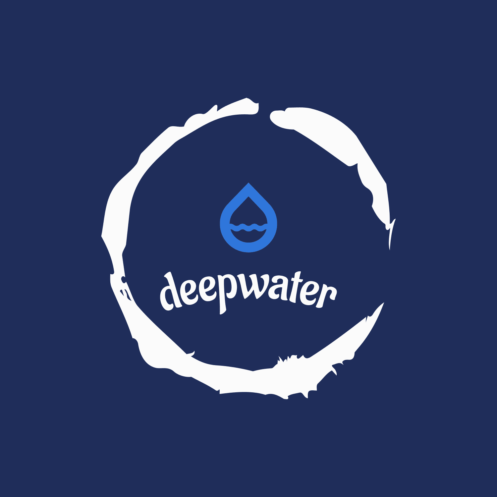

# Visual Assessment of Water's Purity by Utilizing Machine Learning and Computer Vision

## Introduction

Our project leverages advanced machine learning algorithms and computer vision techniques to provide a cost-effective, efficient, and non-invasive method for monitoring water quality. This system aims to ensure high accuracy in determining the purity levels of water samples, which is crucial for environmental protection, public health, and industrial processes.

## Challenge

The primary challenge is to develop an automated system capable of accurately assessing the purity of water samples by analyzing visual data. The system must be robust, adaptable, and scalable to handle varying environmental conditions and large volumes of data. Additionally, it should be able to incorporate future advancements and changes in water purity standards.

## Project Steps

### 1. Data Collection and Analysis
- **Objective**: Collect a comprehensive dataset of water sample images under diverse environmental conditions.
- **Details**: Create a robust dataset with labeled images representing various levels of water purity.

### 2. ML/DL Model Building
- **Objective**: Develop a machine learning model that can accurately correlate visual patterns and features with water purity levels.
- **Details**: 
  - Use computer vision techniques to enhance the model's ability to detect subtle differences in water samples.
  - Employ appropriate algorithms, feature extraction methods, and optimize model parameters.
  - Focus on detecting microplastics through computer vision.

## Features
- **High Accuracy**: Ensures reliable purity assessments.
- **Scalability**: Designed to handle large volumes of data efficiently.
- **Adaptability**: Capable of functioning under various environmental conditions and adaptable to future technological advancements and changes in purity standards.

## Image Section

Include relevant images that illustrate:
- Example water samples used in the dataset.
- Visual representation of the computer vision analysis process.
- Output of the machine learning model showing different levels of water purity.

*Insert Images Here*

## Installation

1. Clone the repository: `git clone <repository_url>`
2. Navigate to the project directory: `cd <project_directory>`
3. Install dependencies: `pip install -r requirements.txt`

## Usage

1. Prepare your water sample images and ensure they are labeled appropriately.
2. Run the model training script: `python train_model.py`
3. Use the inference script to assess water purity: `python infer_purity.py --image <path_to_image>`

## Contributing

Contributions are welcome! Please submit issues or pull requests via the project's GitHub repository.

## License

This project is licensed under the MIT License. See the [LICENSE](LICENSE) file for details.

## Acknowledgements

- Thank you to Xylem Hackathon for the opportunity to showcase this project.
- Special thanks to the contributors and supporters of this project.
